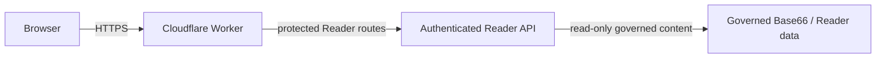
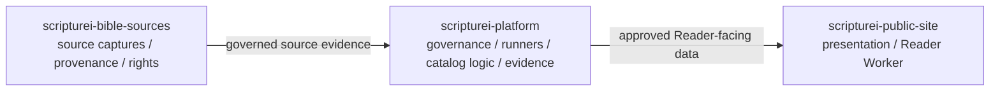
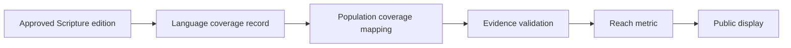
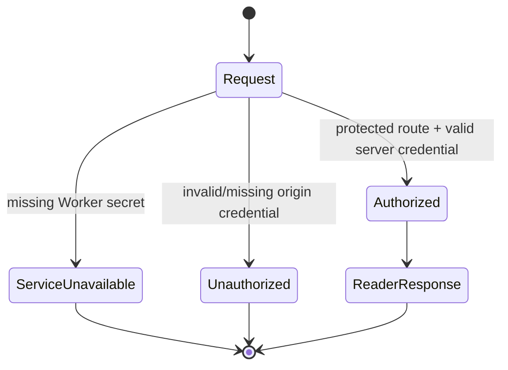

# SCRIPTUREi Public Site Architecture Diagrams R1

STATUS: CURRENT DOCUMENTATION / PUBLIC-SAFE / NON-AUTHORIZING
DATE: 2026-09-17

## 1. Reader request path



The Worker is a presentation/authentication boundary. It does not create Bible authority or rights.

## 2. Protected route boundary

```mermaid
flowchart TD
    R{Request path}
    E[/v1/reader/editions]
    B[/v1/reader/books]
    C[/v1/reader/chapters]
    P[/v1/reader/passage]
    S[/v1/status]
    X[Public assets / site content]
    AUTH[Inject server-side Reader credential]

    R --> E --> AUTH
    R --> B --> AUTH
    R --> C --> AUTH
    R --> P --> AUTH
    R --> S
    R --> X
```

Credential values remain server-side and must not appear in browser code, committed files, logs, or generated public assets.

## 3. Repository responsibility separation



The public-site repository is not the system of record for Bible catalog authority or source rights.

## 4. Reach metric boundary



A reach metric is presentation data derived from governed evidence. It must not be treated as a canon, rights, or publication decision.

## 5. Fail-closed Reader behavior



The recovery path is to restore a valid authenticated Worker/API pair, not to make the Reader origin public.